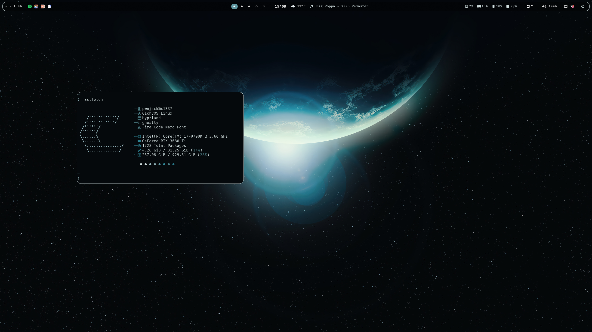
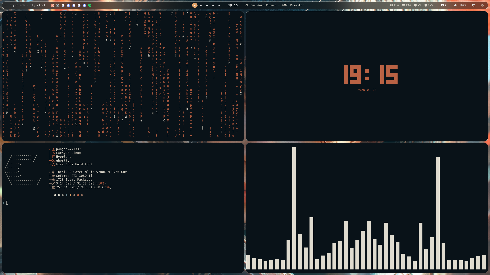
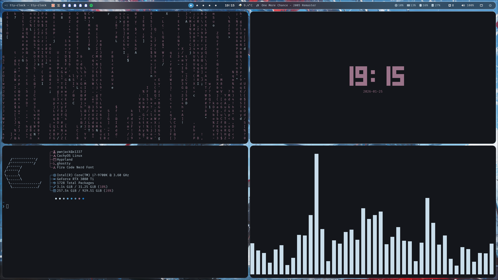
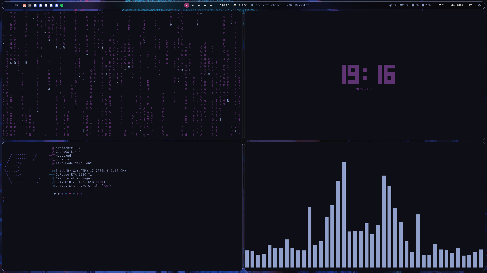
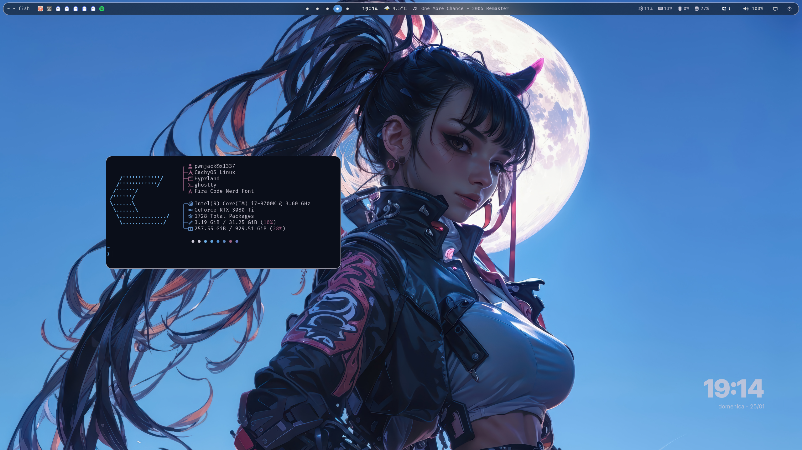
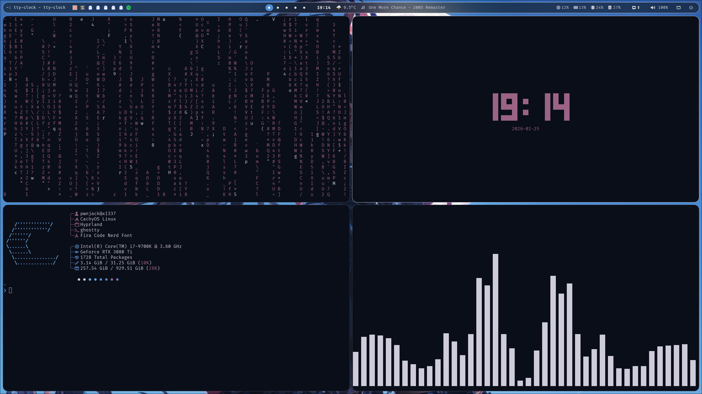

# Hyprland Dotfiles

Modern, minimal Hyprland configuration for Arch Linux / CachyOS with dynamic pywal theming.


## Overview

A clean, production-ready Hyprland setup featuring:

- Modern dark aesthetic with blur and rounded corners
- Dynamic color theming via pywal (colors generated from wallpaper)
- Modular configuration structure for easy customization
- macOS-inspired keybindings

## Screenshots

Dynamic pywal theming adapts colors from your wallpaper across all components. Here are examples with different wallpapers:

| Desktop | Theme Colors |
|---------|--------------|
|  |  |
|  |  |
|  |  |
|  |  |
|  |  |

## Core Stack

| Component | Application |
|-----------|-------------|
| Window Manager | Hyprland |
| Status Bar | Waybar |
| Launcher | Rofi |
| Terminal | Ghostty |
| Notifications | SwayNC |
| Lock Screen | Hyprlock |
| File Manager | Thunar / Yazi |
| Browser | Zen Browser |
| Editor | Neovim |
| Shell | Fish + Starship |

## Structure

```
~/.config/
├── hypr/
│   ├── hyprland.conf           # Main config (sources modules)
│   ├── hyprlock.conf           # Lock screen
│   ├── hypridle.conf           # Idle management
│   └── config/
│       ├── colors.conf         # Pywal colors (symlink)
│       ├── apptype.conf        # Default apps
│       ├── cursortheme.conf    # Cursor theme
│       ├── hardware/
│       │   ├── monitor.conf    # Display setup
│       │   └── input.conf      # Keyboard/mouse
│       ├── looks/
│       │   ├── decor.conf      # Borders, blur, rounding
│       │   └── animations.conf # Window animations
│       ├── setup/
│       │   ├── envvars.conf    # Environment variables
│       │   └── autostart.conf  # Startup applications
│       └── software/
│           ├── general.conf    # Misc settings
│           ├── keybinds.conf   # Keyboard shortcuts
│           └── rules.conf      # Window rules
├── waybar/
│   ├── config.jsonc            # Modules config
│   ├── style.css               # Styling
│   └── colors.css              # Pywal colors
├── rofi/
│   ├── config.rasi             # Main config
│   ├── launcher.sh             # App launcher
│   ├── powermenu.sh            # Power options
│   ├── screenshot.sh           # Screenshot menu
│   ├── keybinds-cheatsheet.sh  # Shortcuts reference
│   └── themes/                 # Rofi theme files
├── swaync/
│   ├── config.json             # Notification settings
│   └── *.css                   # Styling
├── options/                    # User preferences (text files)
├── scripts/                    # Utility scripts
├── fish/                       # Shell config
├── ghostty/                    # Terminal config
└── nvim/                       # Editor config
```

## Keybindings

### Essential

| Key | Action |
|-----|--------|
| `Super + Enter` | Terminal |
| `Super + Space` | App Launcher |
| `Super + Q` | Close Window |
| `Super + L` | Lock Screen |
| `Super + H` | Keybinds Cheatsheet |

### Applications

| Key | Action |
|-----|--------|
| `Super + E` | File Manager |
| `Super + B` | Browser |
| `Super + N` | Neovim |
| `Super + G` | Zed Editor |
| `Super + K` | Calculator |
| `Super + A` | AI Assistant |

### Windows

| Key | Action |
|-----|--------|
| `Super + V` | Toggle Floating |
| `Super + F` | Fullscreen |
| `Super + Shift + F` | Fullscreen (no gaps) |
| `Super + O` | Toggle Split |
| `Super + Shift + V` | Pin Window (PiP) |
| `Alt + Arrows` | Move Focus |
| `Alt + Shift + Arrows` | Move Window |
| `Alt + Ctrl + Arrows` | Resize Window |
| `Super + Tab` | Cycle Windows |

### Workspaces

| Key | Action |
|-----|--------|
| `Super + 1-9,0` | Switch Workspace |
| `Super + Shift + 1-9,0` | Move to Workspace |
| `Super + Left/Right` | Previous/Next |
| `Super + Shift + Left/Right` | Move & Follow |

### Utilities

| Key | Action |
|-----|--------|
| `Super + S` | Screenshot (region) |
| `Super + Shift + S` | Screenshot Menu |
| `Super + Shift + L` | Power Menu |
| `Super + C` | Clipboard History |
| `Super + .` | Emoji Picker |
| `Super + Shift + W` | Random Wallpaper |
| `Super + Ctrl + W` | Wallpaper Picker |

### Waybar

| Key | Action |
|-----|--------|
| `Super + Shift + B` | Toggle Waybar |
| `Super + Alt + B` | Hide Waybar |

## Installation

### Dependencies

```bash
# Core
sudo pacman -S hyprland hyprlock hypridle waybar swaync swww \
               rofi-wayland ghostty fish neovim python-pywal \
               thunar yazi btop cliphist wl-clipboard playerctl

# AUR
paru -S zen-browser-bin hyprshot waybar-weather
```

### Setup

```bash
# Clone
git clone <repo> ~/.config

# Initialize pywal
wal -i ~/Pictures/Wallpapers/your-wallpaper.jpg
ln -sf ~/.cache/wal/colors-hyprland.conf ~/.config/hypr/config/colors.conf

# Set fish as default shell (optional)
chsh -s $(which fish)
```

Log out and select Hyprland from your display manager.

## Configuration

### User Preferences

Simple text files in `~/.config/options/`:

```bash
~/.config/options/
├── browser      # zen-browser
├── terminal     # ghostty
├── launchertype # vertical
├── mainmonitor  # DP-1
└── ...
```

### Pywal Colors

Generate colors from any wallpaper:

```bash
wal -i /path/to/wallpaper.jpg
```

Colors automatically apply to Hyprland, Waybar, Rofi, and SwayNC.

### Visual Tweaks

**Blur & Rounding:** `~/.config/hypr/config/looks/decor.conf`
```conf
decoration {
    rounding = 18
    blur {
        enabled = true
        size = 6
        passes = 4
    }
}
```

**Animations:** `~/.config/hypr/config/looks/animations.conf`

**Window Rules:** `~/.config/hypr/config/software/rules.conf`

### Monitors

Edit `~/.config/hypr/config/hardware/monitor.conf`

## Troubleshooting

**Colors not updating after wal:**
```bash
hyprctl reload
```

**Pywal symlink broken:**
```bash
ln -sf ~/.cache/wal/colors-hyprland.conf ~/.config/hypr/config/colors.conf
```

**Waybar issues:**
```bash
killall waybar && waybar &
```

**Lock screen not working:**
```bash
killall hypridle && hypridle &
```

## License

MIT

## API Keys & Environment Variables

API keys and secrets are stored in `~/.config/.env` (git-ignored).

### Setup

```bash
# Copy the example file
cp ~/.config/.env.example ~/.config/.env

# Edit with your API keys
nano ~/.config/.env
```

### Supported Keys

- `GEMINI_API_KEY` - Google Gemini AI
- `OPENAI_API_KEY` - OpenAI/ChatGPT (optional)
- `ANTHROPIC_API_KEY` - Claude (optional)
- `GROQ_API_KEY` - Groq (optional)
- `MISTRAL_API_KEY` - Mistral (optional)

The `.env` file is automatically loaded by:
- Fish shell (on startup)
- AI assistant launcher script

### Security

- `.env` is git-ignored and never committed
- Use `.env.example` as a template in your repository
- Keep your API keys private
