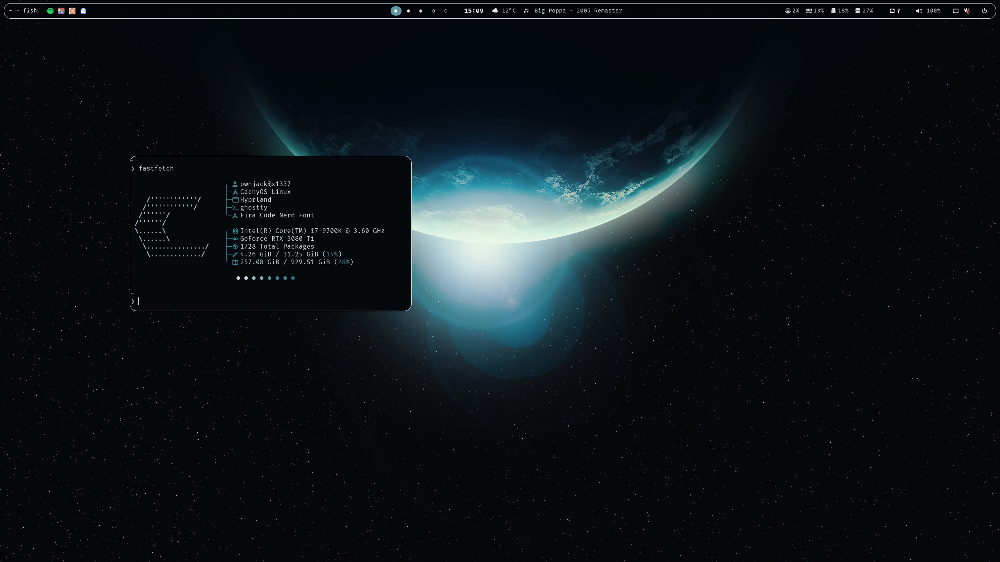
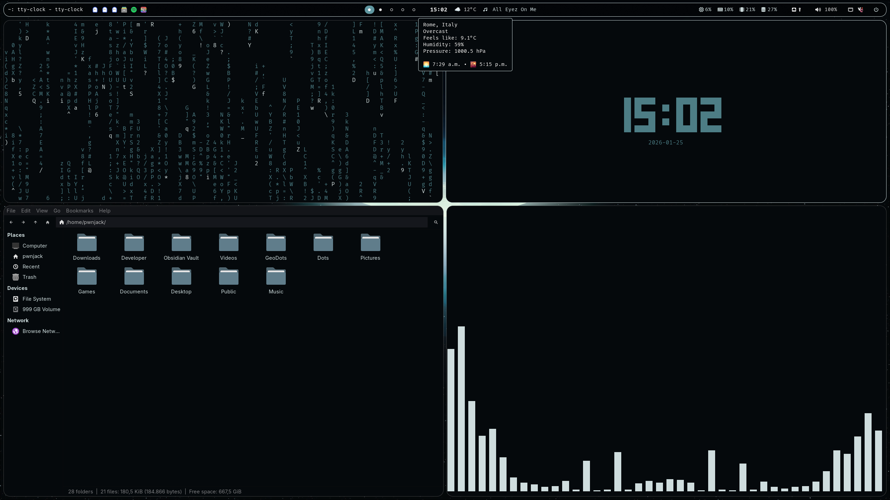
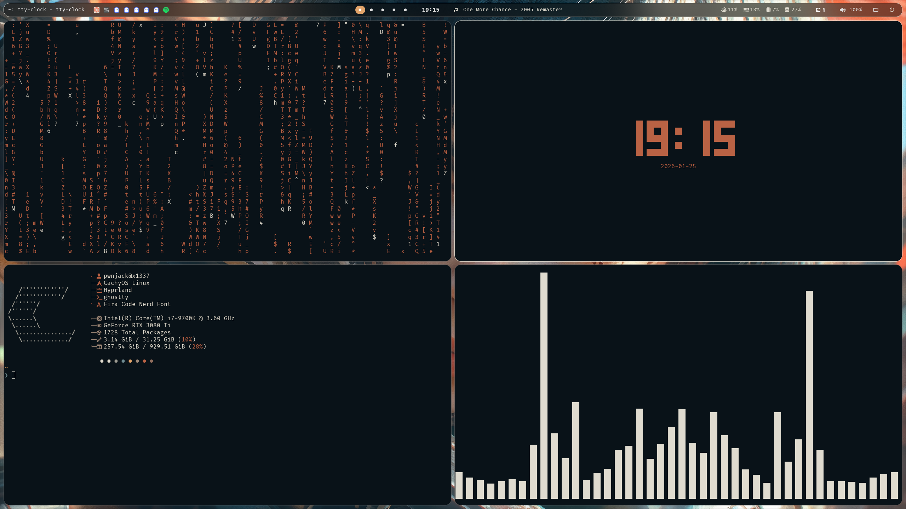
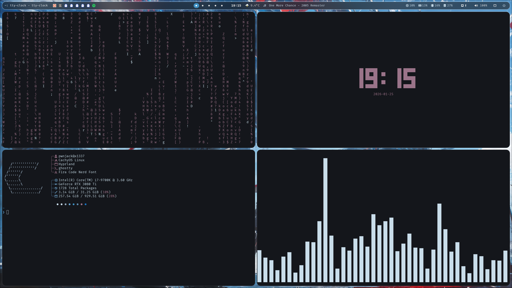
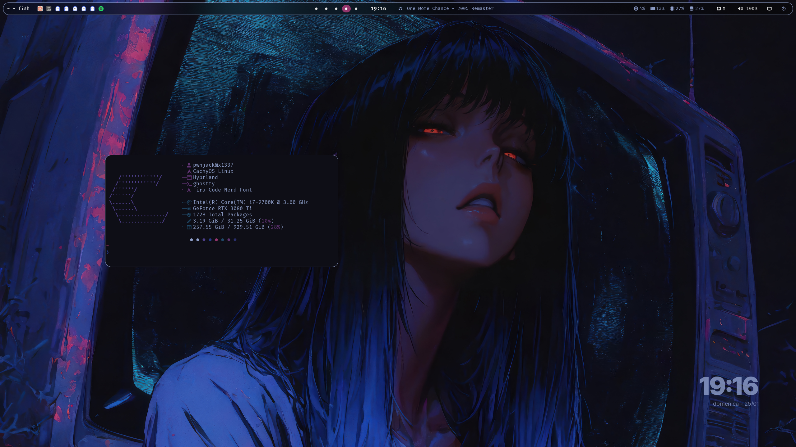
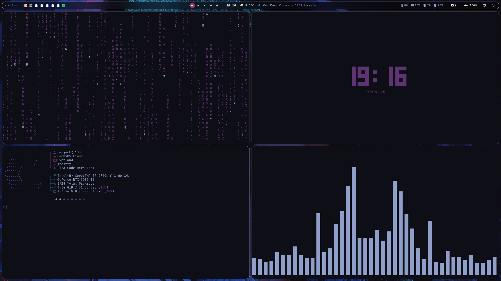
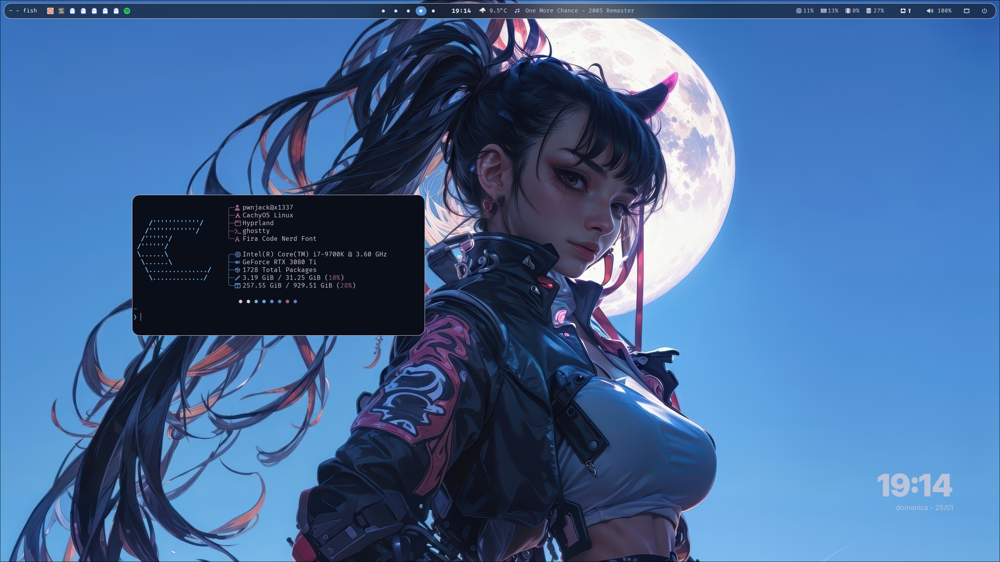
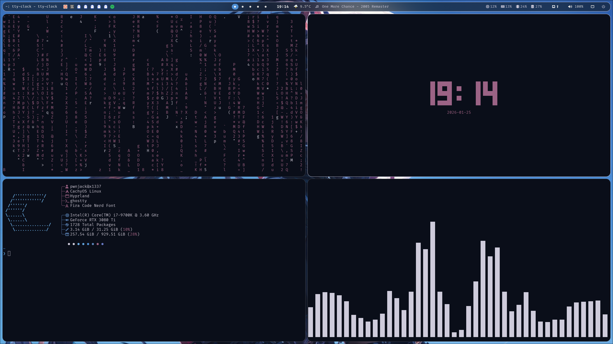

# Hyprland Dotfiles

Modern, minimal Hyprland configuration for Arch Linux / CachyOS with dynamic pywal theming.


## Overview

A clean, production-ready Hyprland setup featuring:

- Modern dark aesthetic with blur and rounded corners
- Dynamic color theming via pywal (colors generated from wallpaper)
- Modular configuration structure for easy customization
- macOS-inspired keybindings

## Screenshots

Dynamic pywal theming adapts colors from your wallpaper across all components. Here are examples with different wallpapers:

| Desktop | Theme Colors |
|---------|--------------|
|  |  |
|  |  |
|  |  |
|  |  |
|  |  |

## Core Stack

| Component | Application |
|-----------|-------------|
| Window Manager | Hyprland |
| Status Bar | Waybar |
| Launcher | Rofi |
| Terminal | Ghostty (`options/terminal`) |
| Notifications | SwayNC |
| Lock Screen | Hyprlock |
| File Manager | Thunar / Yazi |
| Browser | Zen Browser (`options/browser`) |
| Editor | Neovim |
| Shell | Fish + Starship |

## Structure

```
~/.config/
├── hypr/          # Hyprland: modular config sourced from hyprland.conf,
│                  # plus hyprlock, hypridle and hyprsunset
├── waybar/        # Bar: config.jsonc, style.css, pywal colors
├── rofi/          # Launcher, power/screenshot menus, keybinds cheatsheet
├── swaync/        # Notification daemon and sidebar
├── options/       # User preferences, one value per text file
├── scripts/       # doctor/, theming/, waybar/, hyprland/, hooks/, docs/
├── fish/ ghostty/ nvim/ btop/ cava/ starship/   # Per-app config
├── docs/          # Deep dives (keybindings, gaming)
├── test/          # Tests for the runner and the generated docs
├── install.sh     # Fresh-system setup
├── doctor.sh      # Health check (see Maintenance)
└── test.sh        # Test runner (see Maintenance)
```

`CLAUDE.md` carries the detailed `hypr/config/` breakdown and the design notes
behind each piece. Files ending in `.in` are templates and their non-`.in`
counterparts are generated symlinks — edit the template.

## Maintenance

```bash
./doctor.sh          # validate the live system
./doctor.sh --help   # usage
```

`doctor.sh` reports and never modifies anything. Every check derives its
targets from tracked files — git's symlink modes, `source =` lines in
`hyprland.conf`, `exec,` targets in `keybinds.conf`, the package arrays in
`install.sh` — so adding a keybind or an autostart entry extends coverage
automatically. There is no list to keep in sync.

| Severity | Meaning | Exit code |
|----------|---------|-----------|
| `ERROR` | The session is broken or will break on next login | exits 1 |
| `WARN` | Degraded — a keybind does nothing, a daemon did not start | exits 0 |
| `INFO` | Tidiness — orphaned config, package drift | exits 0 |

What it checks:

- **Symlinks** — dangling targets, non-portable absolute paths, and links
  clobbered by a regular file (which git still reports as a symlink)
- **Config references** — every `source =` target, every literal `~/.config`
  path in a tracked file, the `wall.sh` colour fan-out, the pywal cache
- **Binaries** — every command bound in `keybinds.conf` or `autostart.conf`,
  resolving Hyprland's `$variable` indirection first
- **Services** — autostart daemons actually running, who owns
  `org.freedesktop.Notifications`, and `install.sh` package drift
- **Waybar** — every module on the bar has a config block, every block is on
  the bar, and every command an `exec`, click or scroll handler invokes is
  installed

A pre-commit hook (`scripts/hooks/pre-commit`, activated by `install.sh` via
`core.hooksPath`) runs `shellcheck` on staged shell scripts, the test suites
covering whatever the commit touches, and `ags bundle` on staged panel
sources. Bypass with `git commit --no-verify`.

Run every test suite with `./test.sh`. Suites are discovered, not registered:
`./test.sh --list` prints the current set and each one is runnable on its own,
so naming a new file `test-*.sh` or `run-tests.sh` is the whole of adding one.

## Keybindings

| Key | Action |
|-----|--------|
| `Super + Enter` | Terminal (`options/terminal`) |
| `Super + Space` | App launcher |
| `Super + Q/W` | Close window |
| `Super + L` | Lock screen |
| `Super + H` | Keybinds cheatsheet |

Those five are the ones worth memorising.
**[docs/keybindings.md](docs/keybindings.md) has every binding**, grouped by
section — or press `Super + H` for the same list, searchable, without leaving
the desktop.

Both are rendered from `hypr/config/software/keybinds.conf` by one parser, so
neither can drift from the bindings it documents. After editing the config, run
`./scripts/docs/generate-keybindings.sh`; `test/test-docs.sh` fails on a stale
copy, so the pre-commit hook catches a forgotten regeneration.

### Feature notes

The **colour picker** (`Super + Shift + C`) copies the selected screen pixel as
a lowercase hex value and sends a notification.

**Annotation** is opt-in, so the quick grab stays quick: `Super + Alt + S`
captures a region straight into swappy, and the same flow is the fourth entry
of the `Super + Shift + S` menu. Saved images land in `~/Pictures/Screenshots`
with an `_annotated` suffix. swappy reports success by closing, which means you
can save *or* copy one annotation, not both.

The **pending-updates module** sits between the disk and network readouts and
appears only when repository or AUR updates exist — the module showing up is
the notification. Left-click opens `scripts/settings/update.sh` in your
configured terminal; right-click forces a refresh. The AUR command comes from
`options/aurhelper`, and repository checks need `pacman-contrib`
(`checkupdates`).

The **night-light module** reflects the temperature `hyprsunset` has actually
applied. Left-click (or `Super + Shift + D`) switches between warm and neutral
as a manual override — both are overrides, and the daemon reclaims either at
the next scheduled boundary. Right-click (or `Super + Ctrl + D`) hands control
back to the schedule in `hypr/hyprsunset.conf` immediately.

`Super + Shift + B` restarts Waybar; `Super + Alt + B` shows and hides it.

## Installation

### Automated (recommended)

The install script checks/installs all dependencies, deploys the configs to
`~/.config`, initializes pywal, and wires up all symlinks:

```bash
# Clone anywhere (a fresh ~/.config is never empty, so use a staging dir)
git clone <repo> ~/dotfiles
cd ~/dotfiles
./install.sh            # interactive; use --dry-run to preview
```

Log out and select Hyprland from your display manager.

To keep `~/.config` itself under git afterwards (this repo is designed to
live there):

```bash
cd ~/.config
git init -b main
git remote add origin <repo>
git fetch origin
git reset origin/main   # marks repo files as tracked without touching them
```

### Manual

```bash
# Core (official/CachyOS repos)
sudo pacman -S hyprland hyprlock hypridle hyprpolkitagent hyprshot swappy \
               hyprpicker hyprsunset waybar swaync swayosd rofi rofi-emoji \
               ghostty fish starship neovim zed kwrite thunar yazi \
               btop bottom fastfetch cava playerctl cliphist wl-clipboard \
               python-pywal qt5ct qt6ct nwg-look pavucontrol blueman \
               nm-connection-editor gnome-calculator jq ffmpeg inotify-tools \
               zoxide atuin shellcheck pacman-contrib ttf-firacode-nerd \
               ttf-cascadia-mono-nerd ttf-nerd-fonts-symbols noto-fonts \
               noto-fonts-emoji

# AUR / CachyOS-only (paru or yay)
paru -S zen-browser-bin vesktop waybar-weather awww waypaper aichat resources \
        aylurs-gtk-shell libastal-meta

# Initialize pywal
wal -i ~/.config/wallpapers/wall1.jpg
ln -sfn ~/.cache/wal/colors-hyprland.conf ~/.config/hypr/config/colors.conf

# Set fish as default shell (optional)
chsh -s $(which fish)
```

## Configuration

### User Preferences

Simple text files in `~/.config/options/`:

```bash
~/.config/options/
├── browser      # zen-browser
├── terminal     # ghostty
├── launchertype # vertical
├── mainmonitor  # empty = no preference
└── ...
```

### Pywal Colors

Generate colors from any wallpaper:

```bash
wal -i /path/to/wallpaper.jpg
```

Colors automatically apply to Hyprland, Waybar, Rofi, SwayNC, ghostty, Thunar,
cava, btop and the Starship prompt. fastfetch follows too, without any config
of its own — it colours by ANSI index, and the terminal palette is pywal's.

Components needing more than a plain include own a
`<component>/apply_wal_colors.sh`, rendering into `~/.cache/wal/`. The repo
tracks only a symlink to the result, so switching wallpapers never dirties git.
`scripts/theming/apply-wal.sh` runs them all — it finds them by glob, so adding
a themed component means adding one file and nothing else:

```bash
# Re-render every component's colors without changing the wallpaper
~/.config/scripts/theming/apply-wal.sh
```

Two components are templated because neither program can include another file:
edit `cava/config.in` and `starship/starship.toml.in`, never `cava/config` or
`starship.toml` — those are symlinks to the rendered copies.

### Visual Tweaks

**Blur & Rounding:** `~/.config/hypr/config/looks/decor.conf`
```conf
decoration {
    rounding = 18
    blur {
        enabled = true
        size = 6
        passes = 4
    }
}
```

**Animations:** `~/.config/hypr/config/looks/animations.conf`

**Window Rules:** `~/.config/hypr/config/software/rules.conf`

### Monitors

Edit `~/.config/hypr/config/hardware/monitor.conf`

## Troubleshooting

**Colors not updating after wal:**
```bash
hyprctl reload
```

**Pywal symlink broken:**
```bash
ln -sf ~/.cache/wal/colors-hyprland.conf ~/.config/hypr/config/colors.conf
```

**Waybar issues:**
```bash
killall waybar && waybar &
```

**Lock screen not working:**
```bash
killall hypridle && hypridle &
```

## License

MIT

## API Keys & Environment Variables

API keys and secrets are stored in `~/.config/.env` (git-ignored).

### Setup

```bash
# Copy the example file
cp ~/.config/.env.example ~/.config/.env

# Edit with your API keys
nano ~/.config/.env
```

### Supported Keys

- `GEMINI_API_KEY` - Google Gemini AI
- `OPENAI_API_KEY` - OpenAI/ChatGPT (optional)
- `ANTHROPIC_API_KEY` - Claude (optional)
- `GROQ_API_KEY` - Groq (optional)
- `MISTRAL_API_KEY` - Mistral (optional)

The `.env` file is automatically loaded by:
- Fish shell (on startup)
- AI assistant launcher script

### Security

- `.env` is git-ignored and never committed
- Use `.env.example` as a template in your repository
- Keep your API keys private
