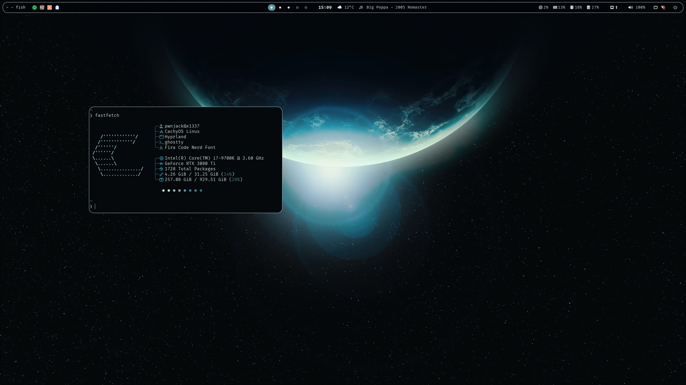
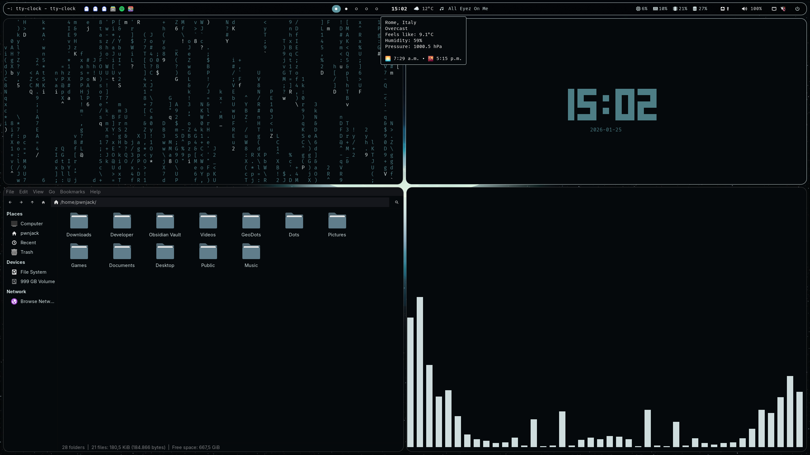
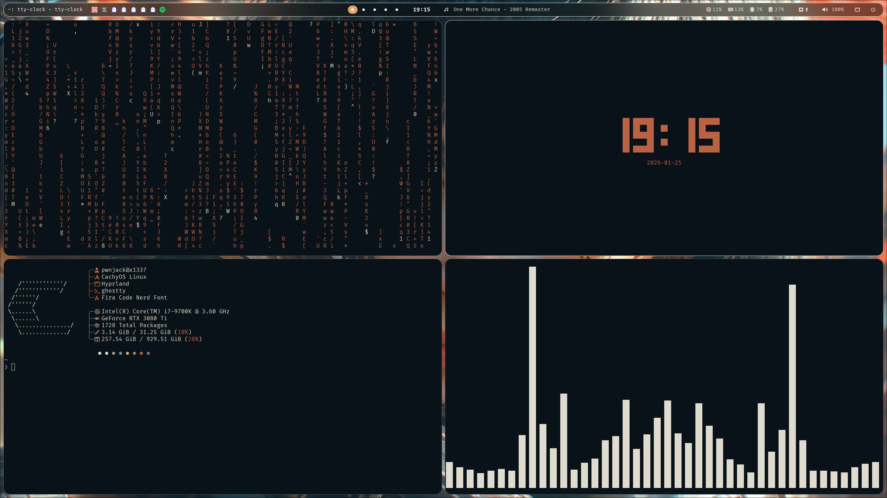
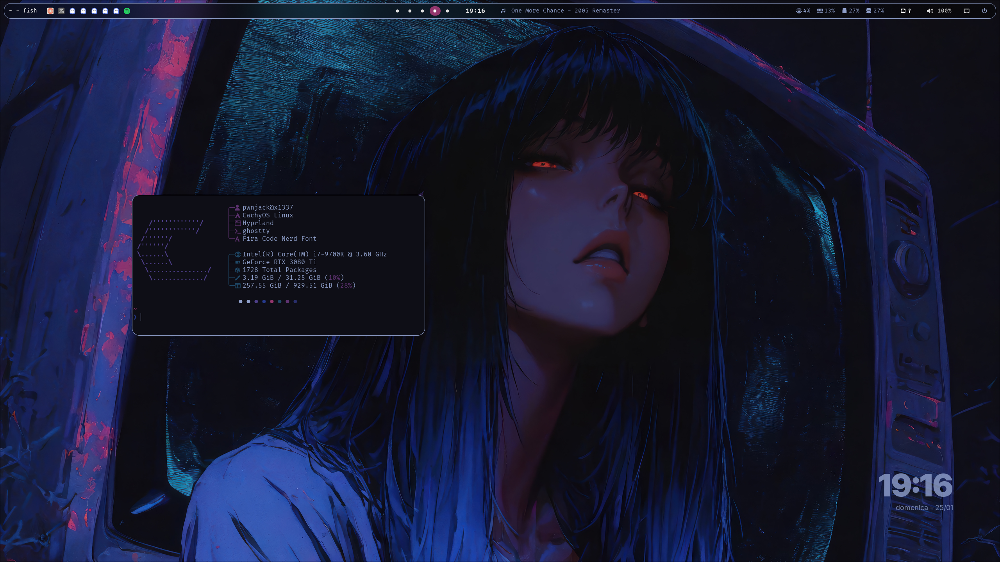
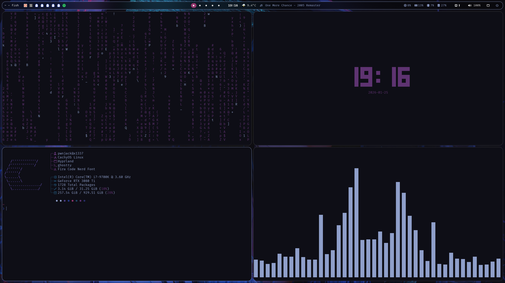

# Hyprland Dotfiles

A complete, ready-to-use Hyprland desktop for Arch Linux and CachyOS. Its
colors follow your wallpaper: change the wallpaper and the bar, launcher,
notifications, terminal and lock screen all re-theme themselves.


## Screenshots

| | |
|---|---|
|  |  |
|  |  |
|  |  |

## Install

On a fresh Arch Linux or CachyOS system, logged in as your normal user:

```bash
sudo pacman -S --needed git
git clone https://github.com/pwnjack/.config.git ~/dotfiles
cd ~/dotfiles
./install.sh
```

The installer asks before installing packages and backs up any file it
replaces; `./install.sh --dry-run` previews everything first. CachyOS ships the
`paru` AUR helper it uses; on plain Arch, install `paru` or `yay` first.

When it finishes, log out and choose **Hyprland** at your login screen — or, if
you have no login manager, type `start-hyprland` in the console.

## First steps

| Keys | Does |
|---|---|
| `Super + Enter` | Terminal |
| `Super + Space` | App launcher |
| `Super + Ctrl + W` | Pick a wallpaper — colors follow |
| `Super + I` | Settings |
| `Super + H` | Every shortcut, searchable |

## More

- [Guide](docs/guide.md) — customization, troubleshooting, maintenance
- [All keybindings](docs/keybindings.md)

## License

[MIT](LICENSE)
